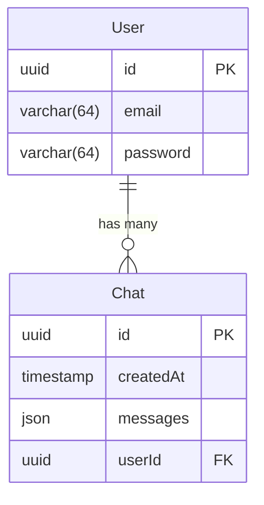
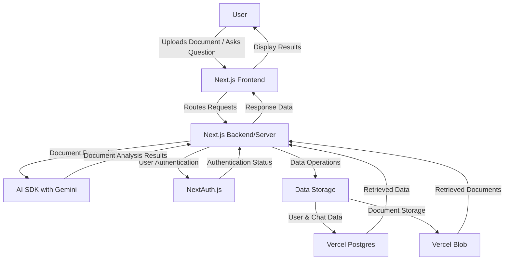
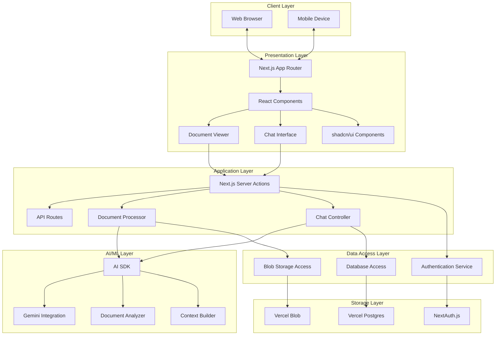
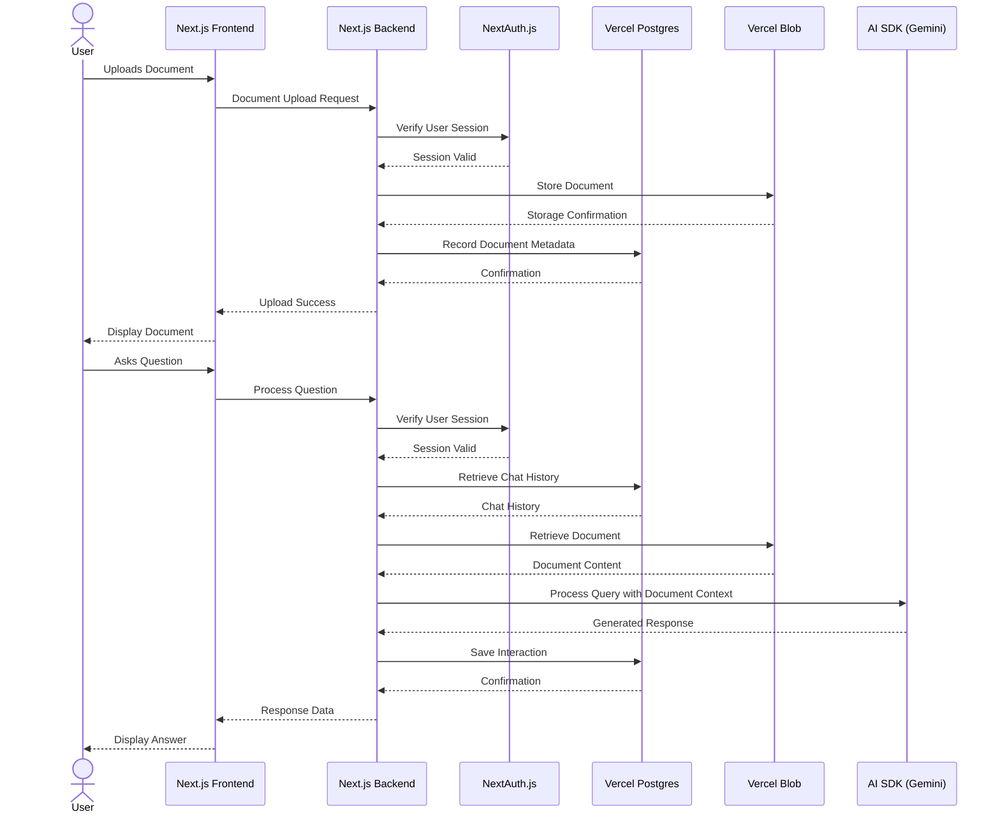

<a href="https://chatpdf-theta.vercel.app//">
  <h1 align="center">Document QA Bot</h1>
</a>

<p align="center">
  An intelligent document analysis assistant powered by Gemini AI
</p>

<p align="center">
  <a href="#features"><strong>Features</strong></a> ·
  <a href="#architecture"><strong>Architecture</strong></a> ·
  <a href="#tech-stack"><strong>Tech Stack</strong></a> ·
  <a href="#installation"><strong>Installation</strong></a> ·
  <a href="#usage"><strong>Usage</strong></a> ·
  <a href="#deployment"><strong>Deployment</strong></a> ·
  <a href="#roadmap"><strong>Roadmap</strong></a>
</p>

<p align="center">
  
  
  
  
  
</p>

<br/>

## 🚀 Features

- **Document Intelligence**
  - Extract key information from PDFs automatically
  - Smart summarization of document contents
  - Context-aware question answering based on document content
  - Support for multiple document formats

- **Advanced UI/UX**
  - 50-50 split screen display for simultaneous document and chat viewing
  - Real-time document analysis and chat interaction
  - Responsive design for desktop and mobile devices
  - Dark/light mode support

- **Modern Tech Stack**
  - [Next.js 14](https://nextjs.org) App Router
    - Advanced routing for seamless navigation
    - React Server Components (RSCs) for optimized rendering
    - Server Actions for secure, direct database mutations
  
  - [Vercel AI SDK](https://sdk.vercel.ai/docs)
    - Streaming responses for real-time interaction
    - Unified API for generating text and structured outputs
    - Hooks for building dynamic chat interfaces
  
  - [shadcn/ui](https://ui.shadcn.com)
    - Beautifully designed components built with Radix UI and Tailwind
    - Fully accessible and customizable interface
    - Consistent design language throughout the application

- **Security & Performance**
  - Role-based access control for document sharing
  - Document encryption for sensitive files
  - Optimized query handling for large documents
  - Rate limiting to prevent API abuse

- **Data Persistence**
  - [Vercel Postgres powered by Neon](https://vercel.com/storage/postgres) for chat history
  - [Vercel Blob](https://vercel.com/storage/blob) for document storage
  - Document version history and change tracking

- **Authentication**
  - [NextAuth.js](https://github.com/nextauthjs/next-auth) for secure user management
  - Multiple authentication providers (Google, GitHub, Email)
  - JWT token-based session management

## 🏗️ Architecture

### Database Schema



### Basic Architecture



### High-Level Design (HLD)



### Low-Level Design (LLD)



## 🚀 API Overview  

This project provides a database utility module using **Drizzle ORM** and **PostgreSQL** to handle users, chats, and reservations. Below is an overview of the available functions:

### 🧑‍💻 User Management  

| Function                         | Description                                |
|----------------------------------|--------------------------------------------|
| `getUser(email: string)`         | Fetches a user by email.                   |
| `createUser(email: string, password: string)` | Creates a new user with a hashed password. |

### 💬 Chat Management  

| Function                         | Description                                |
|----------------------------------|--------------------------------------------|
| `saveChat({ id, messages, userId })` | Saves or updates a chat session.         |
| `deleteChatById({ id })`         | Deletes a chat by its ID.                 |
| `getChatsByUserId({ id })`       | Retrieves all chats for a given user, ordered by creation date. |
| `getChatById({ id })`            | Retrieves a single chat by ID.            |


## 💻 Tech Stack

- **Frontend**
  - Next.js 14 (App Router)
  - React 18 with Server Components
  - Tailwind CSS for styling
  - shadcn/ui component library
  - TypeScript for type safety

- **Backend**
  - Next.js API Routes and Server Actions
  - Vercel AI SDK for LLM integration
  - Gemini AI for document analysis
  - NextAuth.js for authentication

- **Database**
  - Vercel Postgres (powered by Neon)
  - Drizzle ORM for type-safe queries
  - Vercel Blob for document storage

- **DevOps**
  - Vercel for hosting and serverless functions
  - GitHub Actions for CI/CD
  - pnpm for package management

## 📦 Installation

1. Clone the repository:
```bash
git clone https://github.com/yourusername/chatpdf.git
cd chatpdf
```

2. Install dependencies:
```bash
pnpm install
```

3. Set up environment variables:
```bash
cp .env.example .env
```

4. Configure your environment variables in `.env` file:
```
# Database
POSTGRES_URL=your_postgres_connection_string

# Authentication
NEXTAUTH_URL=http://localhost:3000
NEXTAUTH_SECRET=your_nextauth_secret
GOOGLE_CLIENT_ID=your_google_client_id
GOOGLE_CLIENT_SECRET=your_google_client_secret

# Storage
BLOB_READ_WRITE_TOKEN=your_vercel_blob_token

# AI
AI_API_KEY=your_gemini_api_key
```

## 🔧 Usage

1. Start the development server:
```bash
pnpm dev
```

2. Access the application at [http://localhost:3000](http://localhost:3000)

3. Upload a document and start asking questions!

## 🚀 Deployment

### Deploy to Vercel

The easiest way to deploy this application is using the Vercel Platform:

```bash
pnpm i -g vercel
vercel
```

Or connect your GitHub repository to Vercel for automatic deployments.

### Manual Production Build

For a production build:

```bash
pnpm build
pnpm start
```

## 📈 Performance Optimizations

- **Document Chunking**: Large documents are automatically chunked into manageable segments for efficient processing
- **Response Streaming**: AI responses are streamed in real-time for better user experience
- **Semantic Caching**: Similar questions use cached results to reduce API costs and improve response time
- **Progressive Loading**: UI components load progressively for faster perceived performance

## 🛣️ Roadmap

- [ ] Multi-document analysis (comparing information across documents)
- [ ] Custom knowledge base integration
- [ ] Document annotation and collaborative editing
- [ ] Mobile application with offline support
- [ ] Webhooks for integration with third-party services
- [ ] Advanced document analytics dashboard

## 📄 License

This project is licensed under the MIT License - see the LICENSE file for details.

## 🙏 Acknowledgements

- [Vercel](https://vercel.com) for their amazing platform and AI SDK
- [Google](https://ai.google.dev/) for the Gemini AI model
- [shadcn](https://twitter.com/shadcn) for the beautiful UI components
- [NextAuth.js](https://next-auth.js.org/) team for the authentication system
- All contributors who have helped shape this project

---

Built with ❤️ using Next.js, Gemini, and Vercel
