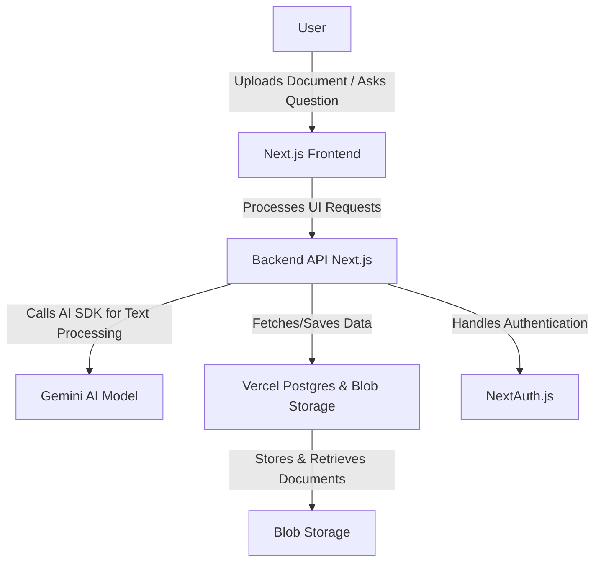
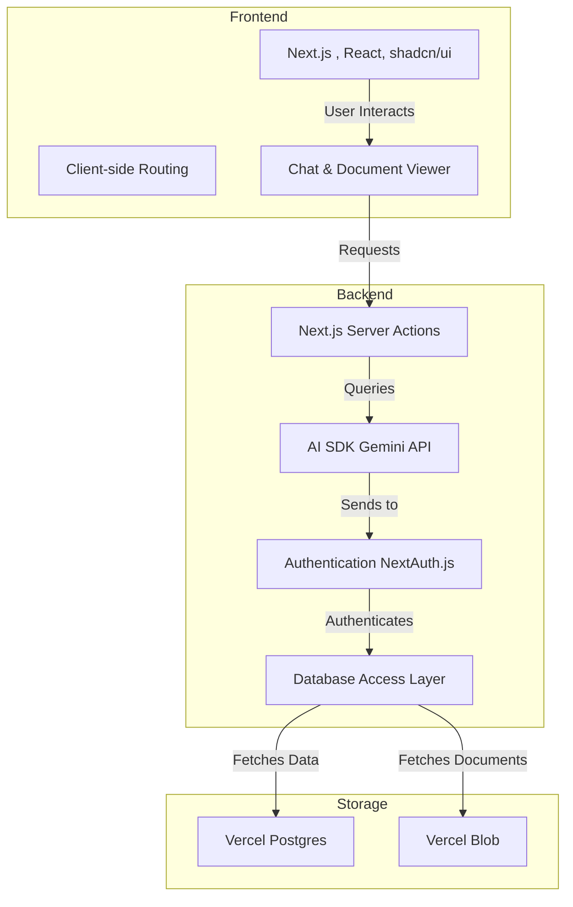
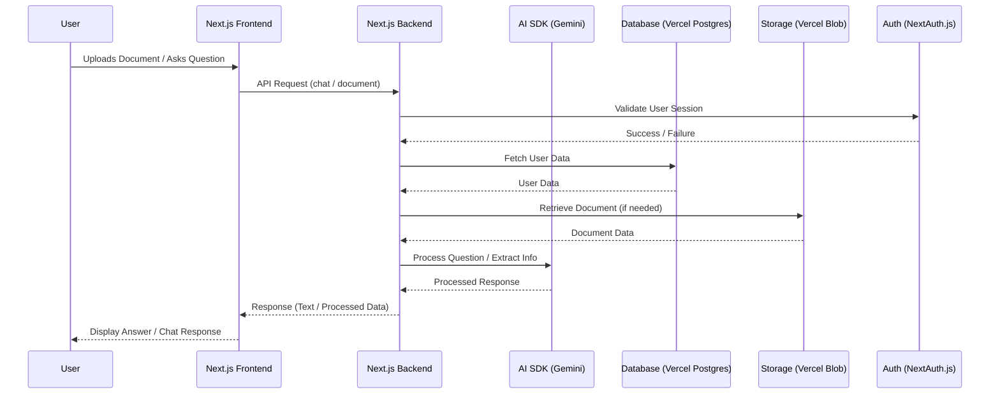

<a href="https://chatpdf-theta.vercel.app//">
  <h1 align="center">Document QA bot</h1>
</a>

<p align="center">
  <a href="#features"><strong>Features</strong></a> ·
  <a href="#installation"><strong>Installation</strong></a> ·
  <a href="#running-locally"><strong>Running locally</strong></a>
</p>
<br/>

## Features

- [Next.js](https://nextjs.org) App Router
  - Advanced routing for seamless navigation and performance
  - React Server Components (RSCs) and Server Actions for server-side rendering and increased performance
- [AI SDK](https://sdk.vercel.ai/docs)
  - Unified API for generating text, structured objects, and tool calls with LLMs
  - Hooks for building dynamic chat and generative user interfaces
- [shadcn/ui](https://ui.shadcn.com)
  - Styling with [Tailwind CSS](https://tailwindcss.com)
  - Component primitives from [Radix UI](https://radix-ui.com) for accessibility and flexibility
- Data Persistence
  - [Vercel Postgres powered by Neon](https://vercel.com/storage/postgres) for saving chat history and user data
  - [Vercel Blob](https://vercel.com/storage/blob) for efficient object storage
- [NextAuth.js](https://github.com/nextauthjs/next-auth)
  - Simple and secure authentication
- Enhanced Chat Interface
  - 50-50 split screen display for simultaneous document and chat viewing
  - Real-time document analysis and chat interaction
  - Seamless PDF document integration

## Installation

1. Clone the repository:
```bash
git clone https://github.com/yourusername/chatpdf.git
cd chatpdf
```

2. Install dependencies:
```bash
pnpm install
```

## Running locally

1. Set up environment variables:
```bash
cp .env.example .env
```

2. Configure your environment variables in `.env` file

3. Start the development server:
```bash
pnpm dev
```

Your application will be running at [http://localhost:3000](http://localhost:3000)

4. For production build:
```bash
pnpm build
pnpm start
```

---

### **1. Basic Architecture**
This diagram provides an overview of the system, showing how the user interacts with the application.



---

### **2. High-Level Design (HLD)**
This diagram shows key components of the system and their interactions.



---

### **3. Low-Level Design (LLD)**
A more detailed view, breaking down request handling, storage, and authentication.



---

These diagrams represent the system at different levels of abstraction, from **basic structure** to **detailed request flow**. Let me know if you need modifications or explanations! 🚀
